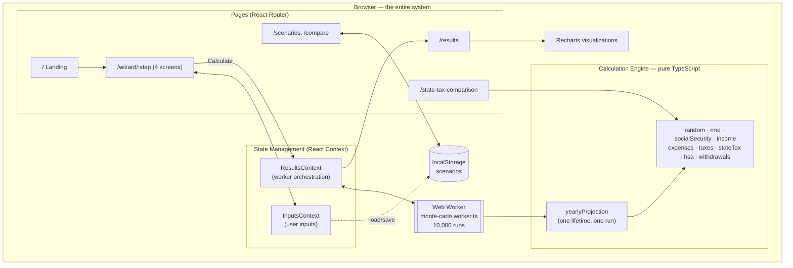
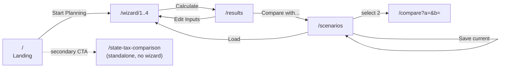
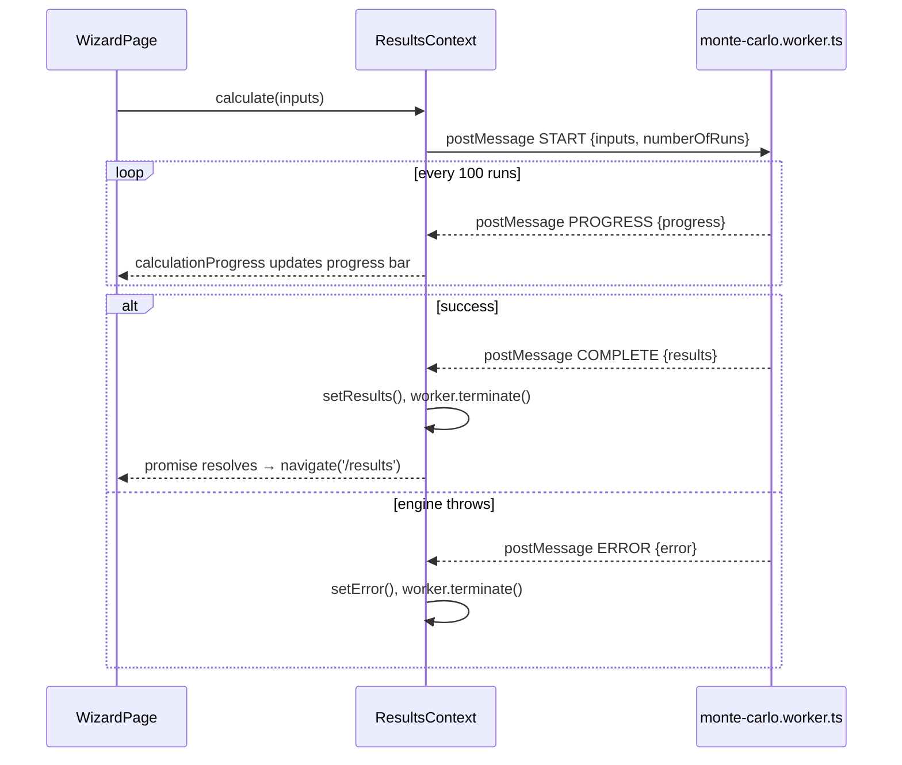
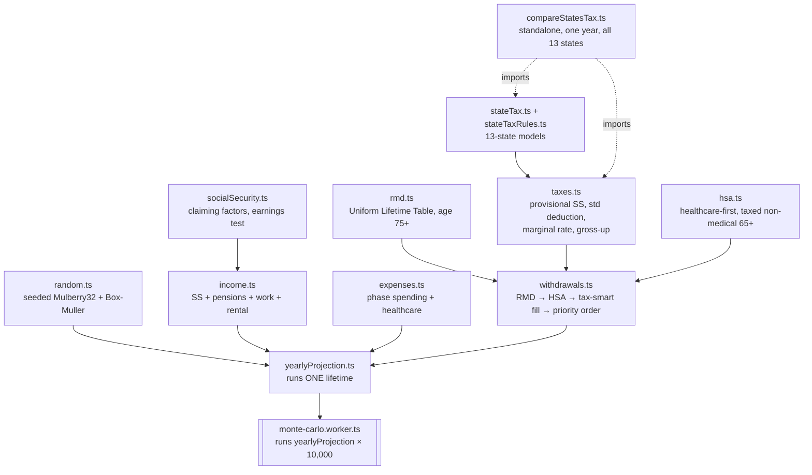

# Retirement Planning Simulator — System Design

A concise architectural reference: how the pieces fit together and why. For product
behavior see [`1-requirements.md`](1-requirements.md). This document is deliberately light
on code — pseudo-code and diagrams only.

---

## 1. Architectural Overview

**Client-only SPA.** No backend, no database, no API calls. Every input, calculation, and
result stays in the browser tab; only `inputs` (never results) persist, to `localStorage`.



**Why a Web Worker:** 10,000 lifetime simulations would freeze the main thread for
several seconds. Running them off-thread keeps the UI (and the progress bar) responsive.

**Why pure calculation modules:** every function in `src/lib/calculations/` takes inputs
and returns values — no I/O, no DOM, no `Date.now()`/`Math.random()`. That's what lets the
same code run identically on the main thread, inside the worker, and under Vitest.

---

## 2. Routing & Page Flow



| Route | Page | Notes |
|---|---|---|
| `/` | `LandingPage` | Marketing/value-prop; CTA into wizard, secondary CTA into state-tax tool |
| `/wizard/:step` | `WizardPage` | `step` 1–4; `/wizard` redirects to `/wizard/1` |
| `/results` | `ResultsPage` | Reads `ResultsContext`; redirects to `/wizard/1` if no results and nothing calculating |
| `/scenarios` | `ScenariosPage` | Save/load/delete; select two for `/compare` |
| `/compare?a=<id>&b=<id>` | `ComparisonPage` | Reads two scenarios by id from storage |
| `/state-tax-comparison` | `StateTaxComparisonPage` | Self-contained one-year tax calculator; does **not** touch `InputsContext`/`ResultsContext` |
| `*` | — | Redirects to `/` |

A `ScrollToTop` listener (`App.tsx`) resets scroll position on every route change except
inside `/wizard/*`, which manages its own scroll-to-top on step transitions.

---

## 3. Component Architecture

```
App
├─ InputsProvider
│  └─ ResultsProvider
│     └─ BrowserRouter → ScrollToTop + <Routes>
│        ├─ LandingPage
│        ├─ WizardPage
│        │  ├─ Header (variant="wizard")        — My Scenarios · Basic/Advanced · Reset
│        │  ├─ WizardProgress                    — step indicator, click-to-jump
│        │  ├─ Screen1Plan          (Your Plan)
│        │  ├─ Screen2SavingsIncome (Savings & Income)
│        │  ├─ Screen3Healthcare    (Healthcare)
│        │  ├─ Screen4Assumptions   (Assumptions & Strategy) + RetirementTimeline
│        │  ├─ WizardNavigation                   — Back / Next / Calculate
│        │  └─ Footer
│        ├─ ResultsPage
│        │  ├─ Header (variant="results")         — Back to Wizard · Save · My Scenarios
│        │  ├─ Tabs: Summary · Monte Carlo · Cash Flow · Annual Breakdown · Disclosures
│        │  │  ├─ SummaryDashboard    (gauge, metric cards, p10/p50/p90)
│        │  │  ├─ MonteCarloChart     (lazy)
│        │  │  ├─ CashFlowChart       (lazy)
│        │  │  ├─ AnnualTable         (lazy, CSV/JSON export)
│        │  │  └─ AssumptionsPanel    (mandatory disclosures)
│        │  └─ Footer
│        ├─ ScenariosPage
│        │  ├─ Header (variant="navigation")
│        │  ├─ ScenarioCard[]          — select/compare/load/delete
│        │  └─ Footer
│        ├─ ComparisonPage
│        │  ├─ ResultsComparison, DifferenceSummary, ScenarioPanel × 2
│        │  └─ Header/Footer
│        └─ StateTaxComparisonPage
│           ├─ household + income form → compareStatesTax() (sync, no worker)
│           └─ Header/Footer
```

**Shared components** (`components/common/`): `Header` (three variants sharing one
component), `Footer`, `Logo`, `ScenarioManager` (save dialog on Results), `ScopeBadge`,
`HelpPopover` / `CollapsibleHelpPanel` / `InlineGuidance` (contextual education, §11 of
requirements). `components/ui/` holds shadcn/ui primitives (`button`, `card`, `tabs`,
`tooltip`, `alert`, `input`, `label`) built on Radix.

---

## 4. State Management

Two React Contexts, no external state library.

**`InputsContext`** — the full `UserInputs` tree plus ~20 granular update functions
(`updatePersonal`, `updateAccount`, `updateHSA`, `updateSpouseSocialSecurity`,
`updateWithdrawalStrategy`, …) and scenario bookkeeping (`currentScenarioId`,
`loadFromScenario`). Immutable updates via spread; no external state library needed at
this scale (~50 leaf fields).

**`ResultsContext`** — owns `results`, `isCalculating`, `calculationProgress`, `error`,
and the single `calculate(inputs)` entry point that spawns and tears down the Web Worker.

### Web Worker protocol



`ResultsPage` and `WizardPage` never talk to the worker directly — only through
`ResultsContext`, so the message protocol has exactly one caller and one listener.

---

## 5. Data Model

Simplified shapes — see `src/types/index.ts` for exact fields and inline rationale.

```
UserInputs
├─ personal          { retirementAge, lifeExpectancy, state, filingStatus?,
│                       spouseAgeAtRetirement? }              // MFJ fields optional
├─ phases[3]          go_go / slow_go / no_go { startAge, endAge, annualSpending }
├─ oneTimeExpenses[]  { description, amount, age }
├─ accounts           { taxDeferred, roth, taxable, hsa }      // balance + return (+ cost basis / non-medical flag)
├─ withdrawalStrategy { priorityOrder, strategy: standard|tax_smart|roth_conversion, conversionCeiling? }
├─ income             { socialSecurity, spouseSocialSecurity?, pensions[], partTimeWork, rentalIncome }
├─ healthcare         { preMedicare, medicare }
├─ tax                { combinedEffectiveRate, stateTaxMode: manual|modeled }
├─ simulation         { numberOfRuns, generalInflationRate, healthcareInflationRate, returnStdDeviation }
└─ mode               basic | advanced
```

```
YearlyProjection (one simulated year, one run)
├─ age, year, phase
├─ income   { socialSecurity, pensions, partTimeWork, rentalIncome, totalBeforeWithdrawals }
├─ expenses { living, healthcarePremiums, healthcareOutOfPocket, oneTimeExpenses, total }
├─ taxes    { onFixedIncome, onWithdrawals, payrollTax, total }
├─ hsa      { balanceStart, healthcareCoverage, nonMedicalWithdrawal, investmentReturn, balanceEnd }
├─ portfolio{ withdrawals{...}, rmdAmount, investmentReturns{...}, balances{...} }
└─ netCashFlow, shortfall, portfolioDepleted

SimulationResults (aggregate of 10,000 YearlyProjection[] runs)
├─ successRate, numberOfRuns, timestamp
├─ percentiles      { p10, p25, p50, p75, p90 }        // final balances
├─ failedRuns        { count, medianAgeOfDepletion }
├─ selectedRuns      { p10, p50, p90 }                  // full YearlyProjection[] for charts
└─ sampleRuns?        ~200 runs for the spaghetti sample (not persisted)

SavedScenario (localStorage)
├─ id, name, createdAt, lastModified
├─ inputs             UserInputs (always)
└─ results?           SimulationResults, slimmed to summary + 3 selected runs (optional)
```

**Backward compatibility.** Two fields were added after the app already had saved
scenarios in the wild: `withdrawalStrategy.strategy` and `tax.stateTaxMode`. Both are
optional in the type and defaulted **on load** (`scenarioStorage.ts`) to whatever the
scenario's original behavior was — `'standard'` and `'manual'` respectively — not to the
new default, so an old plan keeps computing exactly as it did when it was saved.

---

## 6. Calculation Engine

Pure TypeScript modules in `src/lib/calculations/`, composed by `yearlyProjection.ts` into
one simulated lifetime, which the worker then runs 10,000 times with different seeds.



`compareStatesTax.ts` powers `/state-tax-comparison` only — it calls the same `taxes.ts`
and `stateTax.ts` functions directly and synchronously (single year, no Monte Carlo, no
worker), so its numbers stay consistent with the simulation engine by construction rather
than by duplicated logic.

### Per-year withdrawal order (`withdrawals.ts`)

```
1. HSA covers healthcare costs first (tax-free, any age)
2. RMD enforced from tax-deferred (age 75+, regardless of chosen strategy)
3. HSA covers remaining general expenses (age 65+ only, taxed, if allowed)
4. Tax-smart fill: draw tax-deferred up to the standard-deduction floor (skipped if
   strategy = 'standard')
5. Remaining need met via user's priority order (default: taxable → tax-deferred → roth)
6. Shortfall tracked; income-only survival continues after total depletion
```

### Monte Carlo orchestration (`monte-carlo.worker.ts`)

```
FOR runId IN 0..numberOfRuns:
    rng          = createSeededRNG(createRunSeed(runId))   // reproducible per run
    result       = runCompleteSimulation(inputs, rng)      // one lifetime via yearlyProjection
    store {runId, success, finalBalance, ageOfDepletion}   // ~50 bytes/run
    IF runId in sampleIndices: cache full YearlyProjection[]   // ≤200 runs, for charts

sort runs (failed-first by depletion age, then by final balance)
percentiles  = balances at sorted p10 / p25 / p50 / p75 / p90 indices
selectedRuns = re-run p10 / p50 / p90 if not already cached, keep full projections
RETURN { successRate, percentiles, selectedRuns, sampleRuns, failedRuns }
```

Determinism invariant: exactly two `rng()` calls per simulated year (one Box-Muller pair
per account-shock draw), so the same `inputs` + `runId` always reproduce the same year.

---

## 7. Storage Schema

`localStorage` only, inputs-first — results are optional and always disposable.

```
retirement_scenarios_list        → string[] of scenario ids
retirement_scenario_<id>         → SavedScenario JSON

SavedScenario.results, when present, is "slimmed":
  kept:    successRate, percentiles, failedRuns, selectedRuns (p10/p50/p90 only)
  dropped: sampleRuns (~200 full projections — the largest chunk)
  effect:  ~12 MB in-memory result → ~50 KB on disk
```

- **`MAX_SCENARIOS = 5`** — enforced on save; user must delete before adding a sixth.
- Loading a scenario reruns the wizard's `InputsContext`, not the simulation — if the
  saved scenario has no `results` (loaded from a scenario saved mid-wizard), `ResultsPage`
  redirects back to `/wizard/4` instead of showing an empty dashboard.
- Storage-quota errors are caught and surfaced as an actionable message (`StorageError`
  with a `code`: `QUOTA_EXCEEDED` / `MAX_SCENARIOS` / `DUPLICATE_NAME`), not a silent
  failure.

---

## 8. Performance Strategies

| Strategy | Where | Effect |
|---|---|---|
| Web Worker | Monte Carlo (10,000 runs) | Main thread never blocks; progress bar updates every 100 runs |
| Minimal per-run storage | worker | Only `{success, finalBalance, ageOfDepletion}` kept for all 10,000 runs; full year-by-year detail kept for just the ~200 sampled + 3 selected runs |
| `React.lazy` + `Suspense` | Cash Flow / Monte Carlo / Annual Breakdown tabs | Summary tab (default) renders instantly; heavier charts load on demand |
| `useMemo` | chart data transforms | Recomputes only when `results` changes, not on every render |
| Results slimming | scenario save | ~12 MB in-memory results → ~50 KB persisted |

Actual Monte Carlo runtime: **10,000 runs in roughly 1–2 seconds** on a modern laptop
(off the main thread; UI stays interactive throughout).

---

## 9. Visualization Layer

Recharts (`ComposedChart` for cash flow, custom line/area combinations for Monte Carlo).

- **Success gauge** — color-coded: green ≥90%, yellow 75–89%, orange 50–74%, red <50%.
- **Cash-flow chart** — stacked income bars (SS, pensions, work, rental) and expense bars
  (living, healthcare, taxes, one-time) against a dual y-axis portfolio-balance line with
  p10/p50/p90 bands.
- **Monte Carlo chart** — simplified 3-line view (worst 10% / median / best 10% of
  outcomes), explicitly labeled with statistical language, not a 200-line "spaghetti"
  chart (an earlier design direction, dropped for clarity).
- **Annual breakdown table** — full year-by-year detail with a p10/p50/p90 toggle; CSV and
  JSON export (the JSON bundle feeds `python3 scripts/verify_plan.py`, the independent
  cross-check referenced in `CLAUDE.md`).

---

## 10. Error Handling & Edge Cases

- **Worker failure** (`onerror` or `{type: 'ERROR'}`) → `ResultsContext` sets `error`,
  terminates the worker; `ResultsPage` renders an error card with a return-to-wizard action
  instead of a blank dashboard.
- **Portfolio depletion** — simulation continues on income-only survival past depletion so
  the full horizon is still charted; `success = (ageOfDepletion === null)` and a failed run
  always reports `finalBalance = 0` (never a stranded positive balance misread as a
  near-success).
- **HSA depletion** — healthcare costs fall through to portfolio withdrawals once the HSA
  is exhausted; tracked separately in the projection rather than silently merged into
  general spending.
- **RMD exceeds spending need** — the excess is reinvested to the taxable account rather
  than discarded, and taxed as ordinary income like any other RMD.
- **Tax gross-up non-convergence** — the gross-up solver iterates to within $1 (max
  iterations bounded); a failure to converge falls back to a flat-rate estimate rather than
  throwing, logged for debugging.
- **Storage quota / duplicate name / max scenarios** — all surfaced as typed
  `StorageError`s with a user-facing message (§7), not caught-and-ignored.

---

## 11. Deployment

Static site on **Vercel**, Git-based (push to `main` → production; PRs → preview deploys).
`vercel.json` rewrites all paths to `index.html` so client-side routes survive a hard
refresh. No environment variables, no server-side build step beyond `npm run build`
(`tsc && vite build`).

Privacy posture: `src/lib/analytics.ts` records UI events (page views, wizard step timing,
calculation start/complete) to `localStorage` only, for the user's own session — no
financial data, no PII. It includes an optional `syncAggregateMetrics()` stub that would
`fetch()` an `AnalyticsSummary` to a server: session/event counts, wizard start/completion
counts, average time per wizard step, and counts of calculations run / scenarios saved /
exports — never a dollar amount, age, state, or any other input/result field, and no
identifier beyond a random per-session UUID. It is not called anywhere in the app today, so
in the shipped build no event data leaves the browser.

---

## 12. Project File Structure

```
src/
├── components/
│   ├── common/        Header (3 variants) · Footer · Logo · ScenarioManager
│   │                   ScopeBadge · HelpPopover · CollapsibleHelpPanel · InlineGuidance
│   ├── wizard/         Screen1Plan..Screen4Assumptions · WizardProgress
│   │                   WizardNavigation · RetirementTimeline
│   ├── results/        SummaryDashboard · AssumptionsPanel · CashFlowChart
│   │                   MonteCarloChart · AnnualTable
│   ├── comparison/     ScenarioPanel · DifferenceSummary · ResultsComparison
│   ├── scenarios/      ScenarioCard
│   └── ui/             shadcn/ui primitives (button, card, tabs, tooltip, alert, ...)
├── contexts/           InputsContext · ResultsContext
├── lib/
│   ├── calculations/   random · rmd · socialSecurity · income · expenses · taxes
│   │                   stateTax · stateTaxRules · hsa · withdrawals · yearlyProjection
│   │                   compareStatesTax · index.ts (barrel) + co-located *.test.ts
│   ├── storage/        scenarioStorage.ts
│   ├── constants.ts    DEFAULT_VALUES, US_STATES, RMD table, SS factors
│   ├── analytics.ts    local-only event tracking (§11)
│   ├── exportUtils.ts, exportVerification.ts, format.ts, utils.ts
├── types/index.ts       all shared TypeScript interfaces
├── workers/             monte-carlo.worker.ts
├── pages/               LandingPage · WizardPage · ResultsPage
│                        ScenariosPage · ComparisonPage · StateTaxComparisonPage
└── App.tsx, main.tsx
```

---

## 13. Technology Stack

| Layer | Choice | Version |
|---|---|---|
| UI framework | React | 19.2 |
| Language | TypeScript | 5.2 (strict) |
| Build tool | Vite | 8.1 |
| Routing | React Router | 7.18 |
| Charts | Recharts | 3.10 |
| Styling | Tailwind CSS + shadcn/ui (Radix primitives) | Tailwind 3.4 |
| Icons | lucide-react | 1.27 |
| Testing | Vitest | 4.1 |
| Hosting | Vercel (static, Git-based) | — |

No form library (controlled inputs with HTML-level bounds), no Redux/Zustand (two React
Contexts cover the app's state), no backend framework — there is no backend.

**Browser support:** modern evergreen browsers only (Web Workers + ES2020+ required); no
Internet Explorer. Required: `localStorage`, Web Workers, CSS Grid/Flexbox.

---

**Document version:** 3.0 · **Last updated:** 2026-08-12 · **Status:** aligned with
Requirements v1.9 and the current codebase.

**Changes from v2.1:** full rewrite. Replaced the 6-step wizard / "profiles" / HSA-era
architecture with the shipped 4-screen wizard, "scenarios" storage model, state tax engine
(13 states), married-filing-jointly fields, and three previously-undocumented pages
(`/scenarios`, `/compare`, `/state-tax-comparison`). Corrected dependency versions,
component tree, storage schema (`MAX_SCENARIOS = 5`, optional slimmed results), and the
calculation-engine module graph (added `stateTax`, `hsa`, `compareStatesTax`). Trimmed
verbose benchmark/pseudocode sections. Added Mermaid diagrams for architecture, routing,
worker protocol, and the calculation dependency graph.
